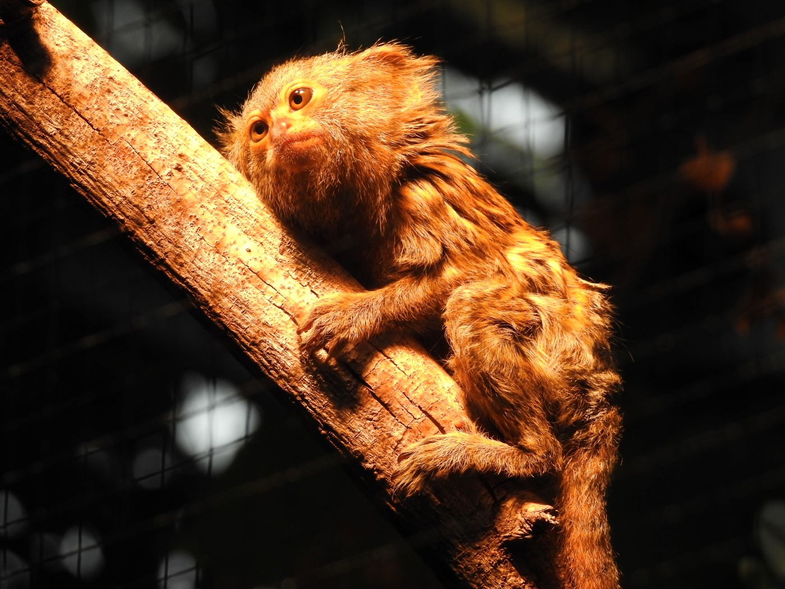

+++
title = "Zoos, zwischen Tier- und Artenschutz  "
date = "2023-04-22"
draft = false
pinned = false
image = "dscn7653.jpg"
description = "Die einen lieben sie, die anderen hassen sie: Zoos. Sind sie die moralisch verwerflichen Tiergefängnisse, für die sie manche halten?  Oder sind sie vielmehr die Arche Noah der Neuzeit und dabei noch ein Spass für Gross und Klein?"
+++
Die einen lieben sie, die anderen hassen sie: Zoos. Sind sie die moralisch verwerflichen Tiergefängnisse, für die sie manche halten?  Oder sind sie vielmehr die Arche Noah der Neuzeit und dabei noch ein Spass für Gross und Klein?

Die Sonne steigt langsam über der Berglandschaft mitten in Bern auf und goldene Strahlen fallen auf den von der Nacht abgekühlten Stein. Die Steinböcke sind bereits wach und klettern auf den Steinhaufen hin und her. Von dort aus sehen sie eine schwer beladene Person in einer dunkelgrünen Jacke, die sich dem Gehege nähert. Die Tiere sind schon ganz aufgeregt, da sie wissen, dass die Fütterung kurz bevorsteht. Sie versammeln sich unter dem falschen Felsen und warten auf die frisch geschnittenen Flechten, Moose und Baumrindenstücke, die ihnen eine leicht verschlafen wirkende Tierpflegerin ins Gehege wirft.  Solche Szenen werden von diversen Organisationen wie „Peta“ oder „Tier im Recht“ kritisiert. Ein Mitglied von letzterer sagte uns: «Aus Sicht des Tierschutzes kann man den nicht domestizierten Wildtieren in Gefangenschaft kein artgerechtes Leben bieten. Die allermeisten Tiere im Zoo sind Wildtiere, die noch natürliche Instinkte haben und es nicht gewohnt sind, mit dem Menschen zu interagieren. Zoos sind schliesslich zur Unterhaltung des Menschen da und Tiere werden als Objekte behandelt.» Sie argumentieren unter anderem damit, dass die Tiere ein Recht auf Freiheit haben oder mit der moralischen Verwerflichkeit, sich am Leid eines Tieres zu ergötzen. Wie wir im Sachbuch Raubkatzen in menschlicher Obhut gelesen haben, ist es wissenschaftlich erwiesen, dass sich sowohl Verhalten als auch Aussehen oder Gewicht von Tieren in Menschenobhut stark verändern (Mirus, 2015, S.16).

Sehen wir uns aber mal die Faktenlage an. Tiere sind schon seit langem ein Teil der Gesellschaft. Tiere sind auch denkende Lebewesen mit Gefühlen und Emotionen und haben deshalb auch Rechte verdient. Viele Staaten haben diese in Gesetzen verankert. Es geht um Haltungsrichtlinien oder das Verbot des willkürlichen Tötens von Tieren. Doch Gesetze lassen sich umgehen und viele sind längst nicht so strikt, wie es für ein lebenswertes Leben eines Tieres sein sollte. Die Zoos als Ursprung allen Übels zu sehen, ist aber nicht der richtige Weg. Tiermissbrauch gibt es auch anderen Orten. Hunde in Handtaschen, Katzen die die Wohnung nicht verlassen dürfen oder gar Qualzüchtungen. Das Thema ist komplex und kontrovers. Die meisten anerkannten Zoos in reichen Ländern orientieren sich an dem 4 Säulen-Prinzip: Bildung, Artenschutz, Forschung und Erholung, wie wir aus dem Internet erfahren haben.

Der Leopard schleicht auf und ab, von Betonwand zu Stahlgitter und wieder zurück. Eine Schar von Kindern steht hinter einer im falschen Felsen eingebauten Glasscheibe. Sie schreien, lachen und zeigen auf die Raubkatze. Der gähnende Leopard ist eine von tausenden Grosskatzen weltweit, welche, oft unter dem Vorwand des Artenschutzes, in Zoos eingesperrt ist. Oft argumentieren Zoos auch damit, dass sie den Menschen Tiere näherbringen, nach dem Motto: "Wir lieben nur, was wir kennen und wir schützen nur, was wir lieben." Auf der einen Seite steht der Artenschutz und auf der anderen der Tierschutz. Die Ursache für das ständige Gähnen sei kein Zeichen von Langweile, sondern habe mit dem Naturell der Grosskatzen zu tun, welche auch in der Natur den Grossteil des Tages mit herumliegen verbringen würden, sagt uns unsere erste Interviewpartnerin, Frau Meret Huwiler, Kuratorin des Tierparks Dählhölzli. Die Zoos könnten somit ein besseres Bild des Tieralltags, als action-geladene Dokumentarfilme präsentieren. Umgekehrt sind Zootiere in ihrer Bewegung eingeschränkt und zeigen oft untypisches Verhalten. Es wird also kein vollständig unverfälschtes Bild der Natur präsentiert. Der Platz ist jedoch nicht das entscheidende, sagt Huwiler, es gehe um die ganze Möblierung.  Es sei sehr wichtig, den Tieren genügend Beschäftigungs-Möglichkeiten zu bieten. In dieser Hinsicht habe sich schon sehr viel getan, als Beispiel nennt sie unseren Treffpunkt, den Bärenpark. Früher lebten die Tiere in einem grauen Betongraben praktisch ohne Einrichtung. Der heutige Bärenpark nimmt viel mehr Rücksicht auf das Tierwohl. Es gibt Rückzugs- und Unterhaltungsmöglichkeiten, wie Asthaufen, einen Schnitzelteil und ein Wasserbecken. Man richtet die Anlagen auf die darin lebende Tierart aus und versucht den Besuchern ein realistisches Bild des Lebensraums zu zeigen. Somit kann man den Menschen einen Bezug zum Tier geben. Huwiler nennt als Beispiel den, nicht weit von Bern, auf dem Gantrisch vorkommenden Auerhahn. Die Wahrscheinlichkeit, dass man einem Auerhahn in der Natur begegnet, sei nahezu null. Der Zoo sorge dafür, dass die Menschen wissen, was ein Auerhahn ist und wo er vorkommt. Somit würde man Respekt vor der Natur gewinnen. Dies sei eine der Hauptaufgaben von Zoos. Eine weitere wichtige Aufgabe sei laut Huwiler der Artenschutz. Der Tierpark Dählhölzli trägt unter anderem mit der Auswilderung von Wisenten in Aserbaidschan dazu bei. Die Auswilderung sei ein langwieriger Prozess. Als erstes müsse der zerstörte Lebensraum wiederhergestellt werden. Dann müsse man die Bevölkerung informieren. Zum Teil sei es nötig Abmachungen bezüglich Wilderei zu treffen oder zu einem Umdenken anzuregen. Es mache keinen Sinn Nashörner frei zu lassen, nur damit sie direkt wieder, wegen ihrem als kostbar geltenden Horn, erlegt werden. Auch die Politik müsse dahinterstehen und unter anderem für den Aufbau und Erhalt von Naturschutzgebieten sorgen. Für eine Auswilderung brauche es auch die richtigen Tiere, d.h. genetisch reine und gesunde. In der Schweiz verzeichneten Zoos vor allem mit der Wiederansiedlung von Bartgeiern und Steinböcken Erfolge. Beide Arten waren in der Schweiz ausgestorben und konnten durch Zucht und Auswilderung zurück gebracht werden.   

Unsere zweite Interviewpartnerin, Frau Alexandra Spring, von der Stiftung Tier im Recht, steht dem Artenschutzargument kritisch gegenüber. Es gäbe so viele vom Aussterben bedrohte Tierarten und nur ein kleinster Bruchteil davon, werde überhaupt in Zoos nachgezüchtet. Zudem sei eine Auswilderung sehr schwierig, man könne nicht einfach so ein Tier im Zoo zur Welt bringen und es dann irgendwo in der afrikanischen Steppe freilassen. Richtiger Artenschutz wäre ihrer Meinung nach Investitionen in den Schutz von Lebensräumen, wie zum Beispiel den Regenwald. Spring ist grundsätzlich gegen Zoos. Ihrer Meinung nach gibt es keinen Weg, ein Wildtier artgerecht einzusperren. Es gäbe jedoch Unterschiede, nicht in allen Zoos würde es den Tieren gleich schlecht gehen. Schweizer Zoos würden da mit gutem Beispiel vorangehen. Auch den Tierpark Dählhölzli bezeichnet sie als vorbildlich. In internationalen Zoos seien hingegen viele Missstände zu sehen. Es gäbe nicht artgerechte Einzelhaltungen, viel zu kleine Käfige und angekettete Tiere. Zudem gibt es immer noch Wale und Delfine in Gefangenschaft, was in der Schweiz mittlerweile verboten ist. Spring denkt, dass man wie bei anderen kulturellen Dingen welche früher normal waren, irgendwann einmal vom Konzept Zoo abkommt. Bis dahin sei es aber noch ein weiter Weg, da Zoos heute noch stark in der Gesellschaft verankert seien. Deshalb freue sie sich schon über kleine Fortschritte, wie die Initiative für Affen Grundrechte in Basel. Diese wurde zwar abgelehnt, aber sie sei schon dankbar, dass man überhaupt darüber gesprochen hatte.  

Fazit: 

Zoos sind aus unserer Sicht nicht grundsätzlich problematisch und haben auch viele positive Effekte. Wenn Rücksicht auf das Wohl und die Würde des Tieres genommen wird, wie dies im Dählhölzli der Fall zu sein scheint, sind Zoos nicht unbedingt schlecht, auch wenn nur ein minimaler Artenschutz betrieben werden kann. In internationalen Zoos hingegen leben Tiere leider noch oft unter schlechteren Bedingungen. Gerade Zoogegner sind in ihrer Argumentationsform eher emotional. Beispielsweise ist das erste Suchergebnis im Internet mit den Suchbegriffen «Peta» und «Zoo» die Überschrift: «Zoos: Gefängnisse für Tiere» zusammen mit einer brutalen Bebilderung. Mit ihrer emotionalen Argumentation haben die  Zoogegner*innen jedoch auch eine wichtige Rolle, in der sie schon an vielen Verbesserungen für Zootiere beteiligt waren. Der Berner Bärengraben und Delfine in Schweizer Zoos, gehören der Vergangenheit an. Aus heutiger Perspektive sind solche Dinge ethisch längst nicht mehr vertretbar. Es brauchte jedoch Bewegungen, die den Stimm- und Rechtslosen eine Sprache gegeben haben. Heute sind wir bei weitläufigen, den nordirischen Nadelwälder angelehnten, Gehegen für Elch und Rentier. Aber reicht das? Diese Frage zu stellen ist wichtig für die Entwicklung der Gesellschaft. Der Trend ist jedoch positiv und es gibt viele kleine Fortschritte, wie zum Beispiel die oben erwähnte Initiative für Affenrechte. Ob Zoos nun moralisch vertretbar sind kann nicht abschliessend geklärt werden. Diese Frage wird weiterhin stark diskutiert werden müssen, noch immer findet man in den Medien mehr Artikel über niedliche Jungtiere als über die Zoo-Kontroverse an sich. Zusammenfassend denken wir, dass der Zoo weder Titanic noch Arche Noah für die Tiere  darstellt.